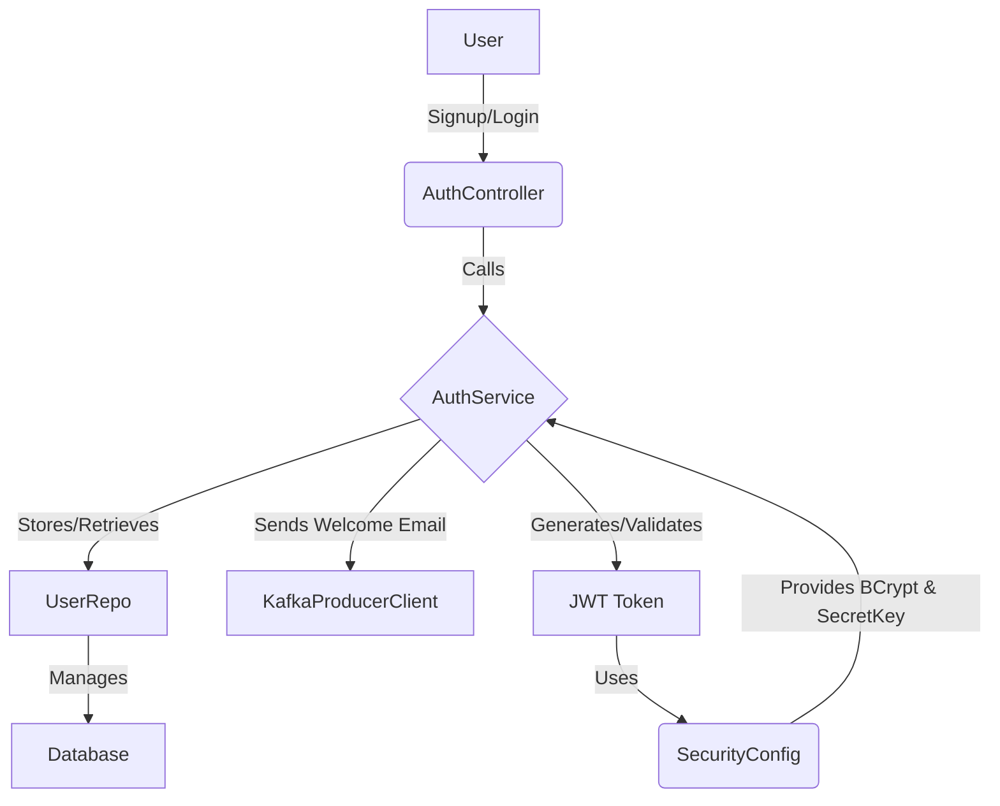

# User Authentication Service

This project implements a user authentication service using Spring Boot. It provides functionalities for user signup, login, logout, and token validation.

## Technologies Used

The following technologies are used in this project:

*   **Spring Boot**: Framework for building the application.
*   **Spring Web**: Provides RESTful API capabilities.
*   **Spring Data JPA**: For database interaction and object-relational mapping.
*   **Spring Security**: For authentication and authorization, including password encoding (BCrypt) and JWT integration.
*   **Spring Boot Starter OAuth2 Authorization Server**: Likely used for OAuth2 related features, though the current implementation focuses on JWT.
*   **H2 Database**: An in-memory database used for development and testing. (Can be replaced with MySQL as commented in `pom.xml`)
*   **Spring Kafka**: For integrating with Apache Kafka to send messages (e.g., welcome emails).
*   **Spring Cloud Netflix Eureka Client**: For service registration and discovery in a microservices architecture.
*   **JJWT (Java JWT)**: Library for creating and verifying JSON Web Tokens.
*   **Lombok**: Reduces boilerplate code (e.g., getters, setters).
*   **Maven**: Build automation tool.
*   **Java 17**: Programming language version.

## Database Schema

The application uses an `app_user` table to store user information. The `BaseModel` provides common fields for all entities.

### BaseModel

| Field       | Type   | Description                               |
| :---------- | :----- | :---------------------------------------- |
| `id`        | `Long` | Primary key, auto-generated               |
| `createdAt` | `Date` | Timestamp when the record was created     |
| `lastUpdatedAt` | `Date` | Timestamp when the record was last updated |
| `state`     | `ENUM` | Current state of the record (ACTIVE, INACTIVE) |

### User

Extends `BaseModel`.

| Field       | Type     | Description             |
| :---------- | :------- | :---------------------- |
| `emailId`   | `String` | User's email (unique)   |
| `password`  | `String` | Hashed user password    |

## User Flow Diagram

## Module Connections and MVC Pattern

This project follows the Model-View-Controller (MVC) architectural pattern, a common pattern in Spring Boot applications, although "View" part is implicit in a RESTful API.

*   **Controller (`AuthController.java`)**: Handles incoming HTTP requests, processes input, and returns responses. It acts as the entry point for user interactions (signup, login, logout, validate token). It interacts with the `AuthService` to perform business logic.

*   **Service (`AuthService.java` and `IAuthService.java`)**: Contains the core business logic of the application. `IAuthService` is an interface defining the contract, and `AuthService` provides the implementation. This separation promotes loose coupling and testability. The `AuthService` interacts with:
    *   `UserRepo` for database operations.
    *   `BCryptPasswordEncoder` for securely hashing passwords.
    *   `SecretKey` for JWT generation and validation.
    *   `KafkaProducerClient` for sending messages (e.g., welcome emails) to a Kafka topic.
    *   `ObjectMapper` for JSON serialization/deserialization when interacting with Kafka.

*   **Repository (`UserRepo.java`)**: An interface that extends `JpaRepository`, providing methods for CRUD (Create, Read, Update, Delete) operations on the `User` entity, abstracting away the low-level database interactions.

*   **Models (`BaseModel.java`, `State.java`, `User.java`)**: Represent the data structure and business objects of the application. `User` is the primary entity, and `BaseModel` provides common attributes like `id`, `createdAt`, `lastUpdatedAt`, and `state`.

*   **Configuration (`SecurityConfig.java`, `OAuthConfig.java`)**:
    *   `SecurityConfig` configures Spring Security, including disabling CSRF, allowing all requests, and defining beans for `BCryptPasswordEncoder` and the `SecretKey` used for JWT.
    *   `OAuthConfig` is present but not actively used in the provided code for core authentication flow, suggesting a future extension for OAuth2.

*   **DTOs (Data Transfer Objects)**: Classes in the `dtos` package (`SignupRequestDto`, `LoginRequestDto`, `LogoutRequestDto`, `ValidateTokenDto`, `UserDto`, `EmailDto`) are used to transfer data between the client and the server, ensuring a clear contract for API interactions.

*   **Exceptions**: Custom exception classes (`IncorrectPassword`, `UserAlreadyExists`, `UserNotFound`) in the `exceptions` package provide specific error handling for different scenarios.

*   **Clients (`KafkaProducerClient.java`)**: `KafkaProducerClient` is responsible for sending messages to Kafka, demonstrating integration with external messaging systems.

*   **Security (`CustomUserDetails.java`, `CustomUserDetailsService.java`)**: These classes are typically used in Spring Security to integrate custom user details and provide user-specific data to the security context, though they might be further implemented for role-based authorization.

## Design Patterns Used

*   **MVC (Model-View-Controller)**: As described above, the project adheres to the MVC architectural pattern for structuring the web application.

*   **Repository Pattern**: `UserRepo` demonstrates the repository pattern, providing an abstraction layer over the data persistence layer. This separates the business logic from the data access logic.

*   **Service Layer Pattern**: The `AuthService` acts as a service layer, encapsulating the business logic and orchestrating operations across different components.

*   **Dependency Injection**: Spring Framework heavily utilizes dependency injection (e.g., `@Autowired`) to manage component dependencies, promoting loose coupling and testability.

*   **Singleton Pattern**: Spring beans, by default, are singletons, meaning only one instance of a bean is created and managed by the Spring container.

*   **Observer Pattern (via Kafka)**: The use of Kafka for sending welcome emails implies an observer pattern, where the authentication service publishes an event (user signup), and other services (e.g., an email service) can subscribe to and react to these events.
