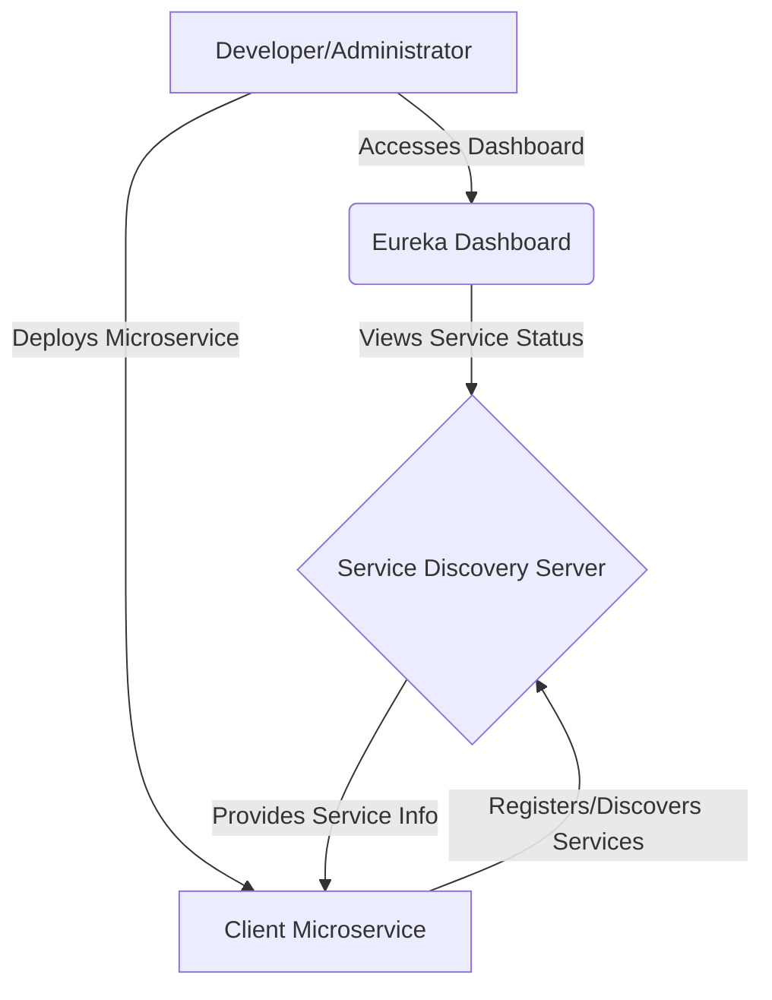

# Service Discovery Project

## Project Description

This project implements a Service Discovery mechanism, which is a crucial component in modern microservices architectures. It allows services to find and communicate with each other without hardcoding network locations. This particular implementation serves as a centralized registry where client applications and other microservices can register themselves and discover other registered services.

## Technologies Used

*   **Java 17**: The core programming language for the application.
*   **Spring Boot 3.x**: Framework for building production-ready, stand-alone Spring applications with minimal configuration.
*   **Maven**: Dependency management and build automation tool.
*   **Eureka Server (Spring Cloud Netflix Eureka)**: This is likely the specific service discovery implementation used, providing a REST API for service registration and discovery.

## Core Functionality

The primary function of this Service Discovery project is to provide a reliable and scalable registry for microservices. It handles:

1.  **Service Registration**: Microservices register themselves with the Service Discovery server upon startup, providing their network location (IP address and port).
2.  **Service Discovery**: Client applications and other microservices can query the Service Discovery server to find the network locations of desired services.
3.  **Health Checks**: The Service Discovery server periodically checks the health of registered services to ensure they are still available. Unhealthy services are de-registered.

## Module Connections

This project, being a Service Discovery server, typically interacts with two main types of external modules:

1.  **Client Microservices**: These are the applications that register themselves with this server and also query it to find other services.
2.  **API Gateway/Load Balancer (Optional but common)**: In a complete microservices ecosystem, an API Gateway might use the Service Discovery to route requests to the correct instances of services.

### Diagram: Module Connections

```mermaid
GRAPH TD
    A[Client Microservice] -- Registers and Discovers --> B(Service Discovery Server)
    C[Another Microservice] -- Discovers --> B
    D[API Gateway/Load Balancer] -- Discovers --> B
```

## MVC Pattern Implementation

For a standalone Service Discovery server built with Spring Boot, the traditional MVC (Model-View-Controller) pattern might not be explicitly visible in the UI sense, as it primarily acts as a backend service with a REST API. However, the principles can be applied conceptually:

*   **Model**: Represents the service instances, their metadata, and the registry itself. This includes data structures holding information about registered services.
*   **View**: While there isn't a traditional web UI, the "view" can be considered the JSON/XML responses returned by the REST API when services are queried. The Eureka dashboard (if enabled) also serves as a view.
*   **Controller**: The REST endpoints (e.g., `/eureka/apps`, `/eureka/instances`) that handle registration and discovery requests. Spring annotations like `@RestController` and `@RequestMapping` define these controllers.

## Design Patterns Used

Several design patterns are inherently used or enabled by a Service Discovery implementation:

*   **Registry Pattern**: This is the core pattern of Service Discovery, where services register themselves with a central registry.
*   **Client-Side Discovery Pattern**: While this project is the server, it enables client microservices to use client-side discovery, where the client queries the registry and then directly calls the service.
*   **Singleton Pattern**: Spring beans, by default, are singletons, meaning the Service Discovery server instance itself often follows this pattern within the application context.
*   **Observer Pattern**: The Service Discovery server often notifies registered clients about changes in service availability (e.g., a service going down), conceptually using an observer pattern.

## Database Schema

Typically, a pure Eureka-based Service Discovery server (like the one implied by the project structure) does **not** use a traditional relational database (like MySQL, PostgreSQL) to store service registration information. Instead, it holds this information in-memory and replicates it among other Eureka server instances for high availability. This is because service registration data is highly dynamic and volatile, making an in-memory solution more performant and suitable.

Therefore, there is no explicit database schema to define for the Service Discovery server itself. The "database" is essentially the in-memory registry of service instances.

## User Diagram



## Getting Started

### Prerequisites

Before you begin, ensure you have the following installed:

*   **Java Development Kit (JDK) 17 or higher**
*   **Apache Maven 3.x or higher**

### Installation

1.  **Clone the repository:**
    ```bash
    git clone <repository-url>
    cd ServiceDiscovery
    ```
2.  **Build the project:**
    ```bash
    ./mvnw clean install
    ```

### Running the Application

To run the Service Discovery server, execute the following command from the project root directory:

```bash
./mvnw spring-boot:run
```

The server will typically start on port `8761` (default Eureka server port). You can access the Eureka dashboard (if enabled) in your browser at `http://localhost:8761/`.
